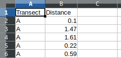
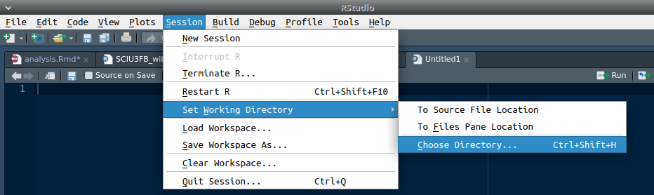
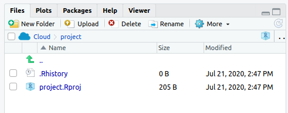

**Estimating the density of populations is a key objective in a lot of ecological research. Accurate estimation of population density can allow us to better monitor managed populations, understand how population density relates to other variables such as habitat, and better understand interactions between species (e.g., mutualism, competition, predation). Note that these notes can be accessed in [HTML](https://bradduthie.github.io/wildlife_sampling_mini-project/analysis.html), [PDF](https://bradduthie.github.io/wildlife_sampling_mini-project/analysis.pdf), or [DOCX](https://bradduthie.github.io/wildlife_sampling_mini-project/analysis.docx) form.**

In the wildlife sampling mini-project, we practiced distance sampling in the field or using [an online simulation](https://bradduthie.github.io/wildlife_sampling_mini-project/index). We did this using three transects, the starts and ends of which were marked by flags. In sampling, you should have walked along the transect in a straight line looking for BBQstick (*BBQstick bbqstick*) individuals perpendicular to the transect. Upon observation, you should have recorded the distance in metres of the BBQstick from the transect. The data you collected should therefore look similar to the below.

```{r, echo = FALSE}
library(knitr);
dat <- read.csv("MyTransect.csv", header = TRUE);
kable(head(dat));
```

To get started with the analysis, you need to create a [CSV file](https://en.wikipedia.org/wiki/Comma-separated_values) with the collected data. You can do this using a spreadsheet program such as MS Excel. To get started, in the first row of cells, write your column headings 'Transect' and 'Distance'. Each row that follows will be a unique observation that you made of a BBQstick. For example, the first BBQstick observation above was made in transect `r dat[1,1]`, and was at a distance of `r dat[1,2]` metres away from the transect line. Your exact values will be different. When you fill in all of your values in Excel, do not worry about formatting (e.g., borders and shading) -- the CSV file will not save these anyway. Once you are done typing in all of the names and values into your file, save the file as a CSV (e.g., "MyTransect.csv"). It should look something like the below.



Notice that the top row includes the headers (each a single word with no spaces), and all of the information is in the first two columns of the spreadsheet ('A' and 'B'). This will help avoid any errors in R later when trying to read in the CSV file. You are now ready to load your data into R and begin your analysis.

Why do we need a statistical model to estimate population density?
================================================================================

Our objective is to estimate population density; we want to know how many BBQsticks there are in our sampling area. We could try to count every individual, but often this is just not possible. Instead, what we will do is sample just along one linear transect, and make some reasonable assumptions about the uncertainty of our sampling at different distances from this transect. First, we assume that we can be certain to find any individuals directly on the transect (i.e., at zero distance from it). Second, we assume that as the distance from the transect increases, the probability that we will miss an individual increases (i.e., the BBQsticks become more difficult to detect when they are farther away).


```{r, echo = FALSE}
par(mar=c(0,0,0,0));
plot(x = 0, y = 0, type = "n", xlim = c(0, 40), ylim = c(0, 40), 
     xaxt = "n", yaxt = "n", xlab = "", ylab = "");
arrows(x0 = 0, x1 = 40, y0 = 4, y1 = 4, length = 0.1);
points(x = c(0, 0), y = c(4, 35), pch = 20, cex = 1.5, col = "red");
points(x = c(0, 0), y = c(4, 35), type = "l", lwd = 2, col = "red");
xx <- runif(30, 4, 38);
yy <- runif(30, 8, 38);
points(x = xx, y = yy, col = "green", pch = 20, cex = 1.25);
xp <- exp(-xx/40);
xd <- rbinom(n = length(xx), size = 1, prob = xp);
points(x = xx, y = yy, col = "green", pch = 20, cex = 1.25);
for(i in 1:length(xp)){
  if((xd[i] == 1 & xx[i] < 30) | xx[i] < 14){
    points(x = xx[i], y = yy[i], cex = 1.25);
  }
}
text(x = 2, y = 2, labels = "Start", col = "red");
text(x = 2, y = 38, labels = "End", col = "red");
text(x = 3, y = 7.2, labels = "Easy");
text(x = 3, y = 6, labels = "to");
text(x = 3, y = 4.8,  labels = "see");
text(x = 35, y = 7.2, labels = "Hard");
text(x = 35, y = 6, labels = "to");
text(x = 35, y = 4.8,  labels = "see");
text(x = 1, y = 20, labels = "Transect", col = "red", srt = -90, 
     cex = 1.5);
text(x = 20, y  = 2, labels = "Distance", cex = 1.5);
```

The figure above shows the general idea. The BBQsticks are shown as green dots that are scattered throughout the landscape. The green dots with black circles around them represent individuals that have been successfully detected, while the green dots without black circles around them are individuals that have been missed. Notice that the ones that are father away from the transect (the red line on the left) are not as often detected as ones close to the transect. This should make intuitive sense; as the distance away from the transect increases, the BBQsticks become more difficult to see. Hence, as distance increases, the probability that we detect *B. bbqstick* individuals decreases. **The point of the statistical model is to estimate how detection probability decreases with distance from the transect, so we can account for this decrease when estimating population density.**

What is R, and why are we using it?
================================================================================

The computer programming language R is a powerful and very widely-used tool among biologists for analysing data. You can use it to analyse and plot data, run computer simulations, or even write slides, papers, or books (the document that you are now reading was written in R using a language called 'Rmarkdown'). The R programming language is completely free and open source, as is the popular [Rstudio](https://www.rstudio.com/) software for using it. It specialises in statistical computing, which is part of the reason for its popularity among scientists. 

Another reason for its popularity is its versatility, and the ease with which new techniques can be shared. Imagine that you develop a new method for analysing data, such as the method that we are using in this mini-lab as developed in @Chandler2011 ([PDF](https://esajournals.onlinelibrary.wiley.com/doi/pdf/10.1890/10-2433.1)). If you want other researchers to be able to use your method in their research, then you could write your own software from scratch for them to install and use. But doing this would be very time consuming, and a lot of that time would likely be spent writing the graphical user interface and making sure that your program worked across platforms (e.g., on Windows and Mac). Worse, once written, there would be no easy way to make your program work with other statistical software should you need to integrate different analyses or visualisation tools (e.g., plotting data). To avoid all of this, you could instead just present your new method for data analysis and let other researchers write their own code for implementing it. But not all researchers will have the time or expertise to do this.

Instead, R allows researchers to write new tools for data analysis using simple coding scripts. These scripts are organised into R "packages", which can be uploaded by researchers to the [Comprehensive R Archive Network (CRAN)](https://cran.r-project.org/), then downloaded by users with a single command in R. This way, there is no need for completely different software to be used for different analyses -- all analyses can be written and run in R.

**The downside to all of this** is that learning R can be a bit daunting at first. Running analyses is not done by pointing and clicking on icons as in Excel, SigmaPlot, or JMP. You need to use code. In this mini-lab, we will start with the very basics and work our way up to analysing the data collected from the field to estimate total BBQstick density.

Getting started in R, and the basics
================================================================================

There are two ways that you can use R to do this mini-project. The first way is to download R and Rstudio on your own computer. Both R and Rstudio are free to download and use, and work on any major operating system (Windows, Mac, and Linux). To download R, go to [this page on the Comprehensive R Archive Network](https://cran.rstudio.com/) and follow the instructions for your operating system (OS). To download Rstudio, go to [this page on the Rstudio website](https://rstudio.com/products/rstudio/download/#download) and choose the appropriate download for your operating system.

If you cannot or do not want to download R and Rstudio on your own computer, then you can still use both by going to the [Rstudio Cloud](https://rstudio.cloud/) and running Rstudio from a browser such as Firefox or Chrome. You will need to click the green "Get Started" button and sign up for a free account. I have made a video of myself [signing up for Rstudio cloud](https://www.stir.ac.uk/) using my University of Stirling email, so you can follow the steps shown in the video if you need help signing up.

When you open Rstudio either on your own computer or the cloud, you will see several windows open, including a console. The console will look something like the below.

```
R version 3.6.1 (2019-07-05) -- "Action of the Toes"
Copyright (C) 2019 The R Foundation for Statistical Computing
Platform: x86_64-pc-linux-gnu (64-bit)

R is free software and comes with ABSOLUTELY NO WARRANTY.
You are welcome to redistribute it under certain conditions.
Type 'license()' or 'licence()' for distribution details.

  Natural language support but running in an English locale

R is a collaborative project with many contributors.
Type 'contributors()' for more information and
'citation()' on how to cite R or R packages in publications.

Type 'demo()' for some demos, 'help()' for on-line help, or
'help.start()' for an HTML browser interface to help.
Type 'q()' to quit R.

> 
```

If you click to the right of the greater than sign `>`, you can start using R right in the console. You can use R as a standard calculator here to get a feel for the console. Try typing something like the below (semi-colons are not actually necessary).

```{r, echo = TRUE}
2 + 5;  
4 * 4;  
12 - 3; 
5^2;
```

You can also use some basic mathematical functions in the console. If, for example, you wanted to find the square root of some number, you could use the `sqrt` function below.

```{r, echo = TRUE}
sqrt(256);
```

The console returns the correct answer `r sqrt(256)`. Similar functions exist for logarithms (`log`) and trigonmetric functions (e.g., `sin`, `cos`). The parentheses after the word indicate that some function is being called in R. But functions do not need to be mathematical; for example, the `getwd` function can be used to let you know what directory (i.e., folder) you are working in.

```{r, echo = TRUE}
getwd();
```

So if we were to save or load a file within R, this is the location on the computer from which R would try to load. We could also use the `setwd` function to set a new working directory (type the working directory in quotes inside the parentheses: `setwd("folder/subfolder/etc")`). You can also set the working directory in Rstudio by going to the toolbar and clicking Session > Set Working Directory.

One last thing before we get started with the data analysis. In R, we can also assign values to variables using the characters `<-` to make an arrow. Say, for example, that we wanted to make `var_1` equal 10.

```{r, echo = TRUE}
var_1 <- 10;
```

We can now use `var_1` in the console.

```{r, echo = TRUE}
var_1 * 5; # Multiplying the variable by 5
```

Note that the correct value of `r var_1 * 5` is returned because `var_1` equals `r var_1`. Also note the comment left after the `#` key. In R, anything that comes after `#` on a line is a comment that R ignores. Comments are ways of explaining in plain words what the code is doing, or drawing attention to important notes about the code.

Note that we can assign multiple things to a single variable. Here is a vector of numbers.

```{r, echo = TRUE}
vector_1 <- c(5, 1, 3, 5, 7, 11); # Six numbers
vector_1;      # Prints out the vector
vector_1 + 10; # Prints the vector plus ten
vector_1 * 2;  # Prints the vector times two
vector_1 <- c(vector_1, 31, 100); # Append the vector
vector_1;
```

We can also assign lists, matrices, or other types of objects.

```{r, echo = TRUE}
object_1 <- list(vector_1, 54, "string of words");
object_1;
```

Play around a bit with R before moving on, and try to get comfortable using the console. When you are ready, download the file 'SCIU3FB_wildlife_sampling_miniproject.R' from Canvas, then go to the toolbar in Rstudio and select File > Open File to open it into Rstudio. Alternatively, I have added all of the code to the end of this document, so you could also copy it [here](#appendix) and paste into a new Rscript (select File > New File > R Script). The rest of these notes will walk you through the code step by step.

Installing the required R package
================================================================================

To run our analysis, we first need to install the package 'unmarked'. Like all R packages, this package is free and open source. This means that we can see and reuse all of the code, which the authors have [posted to GitHub](https://github.com/ianfiske/unmarked), a popular host for code. We could also find the R package [on CRAN](https://cran.r-project.org/package=unmarked), along with a lengthy [reference manual](https://cran.r-project.org/web/packages/unmarked/unmarked.pdf) that tells us about all of the functions that it includes and how we can use them. The authors have even included several vignettes (miniature instruction manuals) that provide examples for how researchers might analyse their own data. This mini-project is based on the [Distance sampling analysis in unmarked](https://cran.r-project.org/web/packages/unmarked/vignettes/distsamp.pdf) vignette by [Richard Chandler](https://github.com/rbchan). You do not need to know the details of the 'unmarked' R package or the statistical methodology underlying it to do this lab, but the links in this paragraph give you a good place to start if you want to learn more.

The package 'unmarked' can be installed from CRAN with a single line of code. As you read through below, follow along with the 'SCIU3FB_wildlife_sampling_miniproject.R' Rscript, or write your own by copying and pasting the code into a new script. To run a line on the script, put the cursor on the line and select 'Run' above in Rstudio. You can also use 'Windows_key + r' in Windows, or 'Ctrl + Enter' in Mac and Linux.

```{r, echo = TRUE, eval = FALSE}
install.packages("unmarked"); # This might take some time
```

Once the package is installed, we need to tell R to read it into the console using the 'library' function.

```{r, echo = TRUE}
library("unmarked"); # Other packages that 'unmarked' needs will also load
```

Reading in the collected data
================================================================================

Now we need to read in the data collected from out in the field (or from the [online simulation](https://bradduthie.github.io/wildlife_sampling_mini-project/index)). Make sure that the file is in the same place as your current working directory (`getwd()`). **If you are using a version of Rstudio that you downloaded to your own computer,** then you can change the working directory by going to the top menu and selecting `Session > Set Working Directory > Choose Directory ...`. Your screen should look something like the figure below.



Make sure that you choose the directory on your computer where your CSV file is located. **If you are using Rstudio on the website [rstudio.cloud](https://rstudio.cloud/),** then you can upload your file from your computer to the cloud. TO do this, find the `Files` tab in the lower right area of the window, then select `Upload` and find your CSV file to upload it by clicking `Browse...` under the `File to upload:` text. The figure below shows where you can find the `Upload` button.



I have named my file 'MyTransect.csv', but yours might be different. Once you have selected the correct working directory or uploaded your CSV file to the cloud, you can read your data into the console using the line below.

```{r, echo = TRUE}
dat <- read.csv(file = "MyTransect.csv", header = TRUE);
```

Note above that I have used the 'read.csv' function to read the CSV file into the variable `dat` in R. To make sure that everything looks correct, you can type `dat` in the console to see all of the data printed out. I will use the 'head' function below to just print off the first six rows.

```{r, echo = TRUE}
head(dat);
```

If the data appear to be read into R correctly, then you can move on to the analysis below. The most common error at this point is trying to read a CSV file into R that does not exist, either because the file is misspelled or the directory is incorrect. **Note that everything in R is case sensitive**, meaning that if a letter is capitalised in a file name or a variable, then it needs to be capitalised when you write it out.

Now that we have the data read in and assigned to the variable `dat`, we can summarise it in some different ways. Try typing the functions below into the R console to see what happens. **Note that your data will be different than what is in this document. This means that your plots and analyses should look different, even though the code will be the same.**

```{r, eval = FALSE, echo = TRUE}
names(dat);       # Get the column names in dat
str(dat);         # Compactly display the structure of dat
attributes(dat);  # Get the attributes of dat (e.g., col and row names)
dim(dat);         # How many rows and columns in dat?
summary(dat);     # Summary statistics of dat (e.g., min, max, mean)
```

Note that if you are not sure what a function does, you can use the 'help' function in the console to find out. The 'help' function will bring up the function's documentation. For example, say you were not sure what the function 'attributes' does, or what arguments it takes.

```{r, eval = FALSE, echo = TRUE}
help(attributes); # See 'attributes' documentation: ?attributes also works
```

We can also make a histogram of the distances that we collected. This is a good way to check for outliers. If you end up with a distance that is much too far to be realistic, then check to make sure that you did not type it into Excel incorrectly.

```{r, echo = TRUE}
dat_dists <- dat$Distance; # Gets values from the 'Distance' column
hist(x = dat_dists,        # This is all that is really needed
     main = "",            # Everything below just makes it look nice
     xlab = "Distances",
     cex.lab = 1.25,
     col = "grey");
```

The x-axis above shows distance intervals within which observations were collected. The y-axis shows how many observations were collected within each interval, as illustrated by the height of each bar. In the above example, we can see that more observations were made at low distances than high distances. Since looks good (i.e., no distances that are much to large, or negative), then we can move on with the analysis.

Analysis using the 'unmarked' R package
================================================================================

To get started, we first need to divide our data into bins based on distance classes. If we assume that the furthest distance that we can see is 10 metres, then we can use five classes. These classes will start at 0 m and end at 10 m. If your data include observations further than 10 m from the transect line, then try to make the necessary adjustments to the code to include these further distance classes. 

```{r, echo = TRUE}
yDat <- formatDistData(dat, distCol = "Distance", transectNameCol = "Transect",
                       dist.breaks = c(0, 2, 4, 6, 8, 10));
```

The data from our original object `dat` has now be restructured using the 'formatDistData' function that we downloaded from the 'unmarked' R package (remember, to see what this function does, type `help(formatDistData)`). We can look at how it has been restructured below.

```{r, echo = TRUE}
yDat;
```

Each row in the above corresponds to each transect letter (`r rownames(yDat)`), and each column corresponds to a different interval, the first being from zero to two metres away from the transect (`r colnames(yDat)[1]`), the second being from two to four metres away from the transect (`r colnames(yDat)[2]`), and so forth. 

Next, we need to set the length of each transect. If you sampled your data in the field, then you should have measured your transect length. If you sampled your data using the online simulation, then you can apply the Pythagorean theorem using the $X$ and $Y$ values from the start and end of your transect to calculate the transect length.

$$Length = \sqrt{(X_{start} - X_{end})^2 + (Y_{start} - Y_{end})^2}$$

We can actually do all of the calculations in R. Below is an example where the start of my transect was $X = 15.2, Y = 63$, and the end of my transect was $X = 42.4, Y = 56.3$.

```{r}
sqrt( (15.2 - 42.4)^2 + (63 - 56.3)^2 ); # Calculates transect length
```

Once you have all three of the transect lengths, you will need to store them in a variable like I have done below. Remember to make sure that the order of transect lengths is correct here (i.e., that the first element in the variable is transect 'A', then 'B', then 'C').

```{r, echo = TRUE}
tr_length <- c(28, 28, 60); # Note: Your transect lengths might differ
```

Next, we need to transform the data again with another function in the 'unmarked' R package. Note that you do not need to include the comments (notes after `#` on the lines below). This is just for your reference.

```{r, echo = TRUE}
umf <- unmarkedFrameDS(y = as.matrix(yDat),  # 'as.matrix' puts into matrix form
                       survey = "line", # Clarify that the transect is aline
                       dist.breaks = c(0, 2, 4, 6, 8, 10), # Breaks from above
                       tlength = tr_length, # Vector of transect lengths
                       unitsIn = "m" # The units are in metres
                       );
```

The data are now stored in `umf`, which looks like the below.

```{r, echo = TRUE}
umf;
```

Not much has changed, but this organises the data in a way that can be used by the rest of the code in the 'unmarked' package. We can see more information using 'summary'

```{r, echo = TRUE}
summary(umf);
```

We can also make a histogram to see how many observations (y axis) are in each distance interval (x axis).

```{r, echo = TRUE}
hist(x = umf, xlab = "Distance (m)", main = "", col = "grey");
```

Fitting our model
================================================================================

We are finally ready to fit a model to the data. Since we have no covariates, we will just fit a null model, but you can read @Royle2004 or the unmarked R package [Distance sampling analysis in unmarked](https://cran.r-project.org/web/packages/unmarked/vignettes/distsamp.pdf) vignette to think about alternative models that we could have fitted. The model below recognises that detection probability declines with distance from the transect line (i.e., as individuals get farther away from the transect, it is more likely that you will miss them). The model can be used to 'correct' for the missed individuals and give us an estimate of what the true number of individuals would be at the site had those individuals been successfully observed.

```{r, echo = TRUE}
hn_Null <- distsamp(formula = ~1~1, data = umf, keyfun = "halfnorm", 
                    output = "density", unitsOut = "ha");
```

With the null model, we can now plot the detection function. Do not worry so much about the details here. Instead, focus on the plot and how to interpret it. What does the model predict happens to the detection probability as distance increases? Think about the shape of the curve in the plot below; does it appear to match the histogram?

```{r, echo = TRUE}
predicted_vals <- predict(object = hn_Null, type='det');
sigmaVAL       <- predicted_vals$Predicted[1]; # Just need the first prediction
gxhn_fun       <- function(x) gxhn(x, sigma = sigmaVAL) # Defines function
plot(gxhn_fun, 0, 10,xlab="Distance (m)",ylab="Detection probability",
     lwd = 2, cex.lab = 1.25, cex.axis = 1.25);
```

If you want, you can plot the model and the histogram side by side with the code below. If you are using Rstudio on your own computer, then you can save this image by going to the plot tab and selecting `Export > Save as Image...`. If you are using Rstudio on the cloud, then you can save the image by right clicking on it and selecting `Save as Image...`.

```{r, eval = FALSE}
par(mfrow = c(1, 2)); # This creates a new plotting environment with two columns
plot(gxhn_fun, 0, 10,xlab="Distance (m)",ylab="Detection probability",
     lwd = 2, cex.lab = 1.25, cex.axis = 1.25);
hist(x = umf, xlab = "Distance (m)", main = "", col = "grey", cex.axis = 1.25,
     cex.lab = 1.25);
```

Now that we have a fitted model, we can use this model to predict the density of individuals in our site (in individuals per hectare). 

```{r, echo = TRUE}
site_level_predict <- predict(hn_Null, type = "state");
site_level_density <- site_level_predict$Predicted; # Gets just the predicted
site_level_density;
```

Hence, the model that we parameterised with our data estimates the number of individuals per hectare on the three sites from which we sampled (note, again, that the numbers you get will be different because you have collected different data). Think about how this estimate, and therefore the model, might be useful in a research or management context.

Estimating the total number of individuals on a site
================================================================================

Next, if we know the size of the area from which we sampled, then we can multiply the density by the total area to get the number of individuals at each site from which we sampled. We can get an estimate of this size using the distance we decided that we could see clearly on either side of the transect line. We said that this distance was ten metres on either side of the transect line, so the total area that we observed per transect is a rectangle. Two sides of the rectangle are the length of the transect, and two sides are twice the length of the distance we can see (since we can see on each side of the transect).

```{r, echo = FALSE}
mbox <- function(x0, x1, y0, y1){
    xx <- seq(from=x0, to=x1, length.out = 100);
    yy <- seq(from=y0, to=y1, length.out = 100);
    xd <- c(rep(x0, 100), xx, rep(x1,100), rev(xx));
    yd <- c(yy, rep(y1,100), rev(yy), rep(y0, 100));
    return(list(x=xd, y=yd));
}
par(mar=c(0,0,0,0));
plot(x = 0, y = 0, type = "n", xlim = c(0, 40), ylim = c(0, 40), 
     xaxt = "n", yaxt = "n", xlab = "", ylab = "");
transect_box <- mbox(x0 = 12, x1 = 32, y0 = 4, y1 = 36);
polygon(x = transect_box$x, y = transect_box$y, lwd = 3);
points(x = rep(22, 100), y = seq(from = 4, to = 36, length = 100),
       type = "l", col = "red", lwd = 3);
arrows(x0 = 22, x1 = 31.8, y0 = 6, y1 = 6, length = 0.1, code = 2);
arrows(x1 = 22, x0 = 12.2, y0 = 6, y1 = 6, length = 0.1, code = 1);
text(x = 27, y = 7, labels = "Visible distance");
text(x = 22, y = 1, labels = "Twice the visible distance");
text(x = 20, y = 20, labels = "Transect length", col = "red", srt = 90, 
     cex = 1.5);
```

In the above, imagine that the red line is the transect. The total area of the site is then a rectange as shown above. We can get the total area of this rectangle in metres using the code below. Recall that the transect lengths are stored in `tr_length` (see above).

```{r, echo = TRUE}
tr_length;
```

The area of a rectangle is its length times its width. Since the width is known to be 20 m (twice the visible distance), we can multiply `tr_length` by 20 to get the total area of each site (note, this is also fine if you collected your data in the online simulation; just assume that one unit equals one metre).

```{r, echo = TRUE}
plotArea_m <- tr_length * 20;
plotArea_m;
```

Recall that the site level density (`site_level_density`) that we calcualted from the model was in individuals per hectare. We therefore need to convert the above into plot area per hectares so that the units match. There are 10000 square metres per hectare, so to get the conversion, we need to divide `plotArea_m` by 10000.

```{r, echo = TRUE}
plotArea_h <- plotArea_m / 10000;
plotArea_h;
```

We can now take a look at the transformed numbers to get the site level abundance.

```{r, echo = TRUE}
site_abundance <- site_level_density * plotArea_h; # density times total area
site_abundance;
```

If we wanted to get the total number of individuals over the whole area (i.e., all three sites from which we sampled), then we can just sum up all of the individual level abundances.

```{r, echo = TRUE}
N_hat <- sum(site_abundance);
N_hat;
```

Again, the total number that you get should differ from that above. The exact value itself is not important, but **think about how that number differs from the number of individuals that you observed**. Since each individual that you observed was recorded in a new row of `dat`, we can go back to the original data to remember what the number of observed was.

```{r, echo = TRUE}
dim(dat)[1]; # Could also have used 'nrow(dat)'
```

Why is the total number of individuals *estimated by the model* over all of the transects that you sampled (`N_hat`) different from the number of individuals *that you actually observed*? 

Saving the plots that you make
================================================================================

For your report, you will want to save your plots. There are multiple ways to do this in Rstudio. You could go to the 'Plots' tab in R studio and click on 'Export' to save a plot as an image or PDF. Alternatively, you could also use the code to save a plot to your working directory using the code below.

```{r, eval = FALSE, echo = TRUE}
pdf("Myfigure.pdf"); # Opens a new file to which you will write the plot
par(mfrow = c(1,2)); # Creates two columns for side by side plotting
# The plot and histogram below are the same as those used above
plot(gxhn_fun, 0, 10,xlab="Distance (m)",ylab="Detection probability",
     lwd = 2, cex.lab = 1.25, cex.axis = 1.25);
hist(x = umf, xlab = "Distance (m)", main = "", cex.lab = 0.8, cex.axis = 0.8);
dev.off(); # Closes out the device that was opened (the PDF)
```

You should now see a saved file named 'Myfigure.pdf' in your working directory. That concludes the lab. Below you can find an appendix with all of the relevant R code and comments.

--------------------------------------------------------------------------------

Appendix: R script file {#appendix}
================================================================================

```{r, eval = FALSE}
# Here is your first R script. 
# Any line which begins with a hash (#) is a
# comment, any line without, is a line of code to run You can run code either by
# highlighting it and copy and pasting it into the R Console. Or else, you can
# highlight it and click run in the top right of this frame:

#First we install the package needed:
install.packages("unmarked");
library(unmarked);

# Make sure R knows which folder you use on your computer. Use getwd() to find
# out and setwd() to set the working directory. IN RStudio click on Session in
# the menu bar, then Set Working directory then Choose Directory and then select
# the folder where you data is stored. You won't see your file in the folder at
# this stage, so you just need to know which folder to look for and navigate
# there. If you are struggling here, let me know.

### INSERT DATA
# Make sure that the names of the two columns in your data file are exactly
# Transect and Distance (if not, go back and change them and resave the file)
# What is the name of your file? My data is called Transects.csv
dat <- read.csv("MyTransect.csv", header = TRUE);
# The '<-' symbols above assigns some piece of information (in this
# case your data) to an object (in this case called dat) If we want to look at
# what we have put into an object, we just type its name, like this:
dat;
#And R will print out the contents of the object.

#We can look at different elements of a data like this:
head(dat);
names(dat);
str(dat); 
attributes(dat); 
ncol(dat);
nrow(dat); 
summary(dat); 
plot(dat);
hist(dat$Distance); 
# use 'hist' to check whether you have mistyped any values, there shouldn't be
# any outliers

# We divide our data into bins based on distance classes. Assuming the furthest
# we can see is 10m, we can use 6 classes, starting at 0m and ending at 10m. If
# your data has observations further than 10m from the transect line, see if you
# can make the necessary adjustments to the code to look at these further
# distance classes. (But stick with 10m to start with)
yDat <- formatDistData(dat, distCol = "Distance", transectNameCol = "Transect",
                       dist.breaks = c(0, 2, 4, 6, 8, 10));

# Have a look at the new format of the data:
yDat;

# We record the length of each transect (remember to do this in the correct
# order) 
tr_length <- c(28, 28, 60);

# We need to further transform the data, making sure we have inputed the right
# transect length and number in the length section
umf <- unmarkedFrameDS(y=as.matrix(yDat),  
                       survey="line",dist.breaks=c(0,0.4,0.8,1.2,1.6,2), 
                       tlength=tr_length, unitsIn="m")

#Have a look again:
umf

# Or:
summary(umf)

# Or, make a histogram:
hist(x = umf, xlab = "Distance (m)", main = "", cex.lab = 0.8, cex.axis = 0.8);

# Now we are fitting a model to these data - you can read the tutorial document
# to think about alternative models we could have fitted. The model recognises
# that detection probability declines with distance from the transect line and
# can be used to 'correct' for the missed individuals and give you an estimate 
# of the true number of individuals at the site
hn_Null <- distsamp(formula = ~1~1, data = umf, keyfun = "halfnorm", 
                    output = "density", unitsOut = "ha");

# Here we plot the detection function
predicted_vals <- predict(object = hn_Null, type='det');
sigmaVAL       <- predicted_vals$Predicted[1]; # Just need the first prediction
gxhn_fun       <- function(x) gxhn(x, sigma = sigmaVAL) # Defines function
plot(gxhn_fun, 0, 10,xlab="Distance (m)",ylab="Detection probability",
     lwd = 2, cex.lab = 1.25, cex.axis = 1.25);

# Think about shape of curve - does it match histogram (plot the two graphs side
# by side)
par(mfrow=c(1,2))
plot(gxhn_fun, 0, 10,xlab="Distance (m)",ylab="Detection probability",
     lwd = 2, cex.lab = 1.25, cex.axis = 1.25);
hist(x = umf, xlab = "Distance (m)", main = "", cex.lab = 0.8, cex.axis = 0.8);

# We use our fitted model to predict the density of individuals in our site (in
# individuals per hectare)
site_level_predict <- predict(hn_Null, type = "state");
site_level_density <- site_level_predict$Predicted; # Gets just the predicted
site_level_density;

### CHECK SITE SIZE
# We think we know the size of the area sampled so we can multiply the density
# by the area to get the number of individuals in our site Our transect length
# varied among transects, but we decided we could see 2m either side of the
# transect line (so the area we observed per transect is (2+2)*transect length).
plotArea_m <- tr_length * 20;
# How large is the area in m divided by 10000 to obtain area in hectares 
plotArea_h <- plotArea_m / 10000;
# Have a look at these numbers
plotArea_h;
# Have a look at the transformed numbers
site_abundance <- site_level_density * plotArea_h;
site_abundance;
# We sum over our three transects to get the total number for the whole area.
N_hat <- sum(site_abundance);
N_hat;

#How does this number compare to the number observed?
dim(dat)[1]; # Gets the total number of rows in dat. Could also use nrow(dat).

# To save the two plots for use in your report, first 'open' a pdf and give it a
# file name, like this:
pdf('Myfigure.pdf');
# Then plot your data:
par(mfrow=c(1,2))
plot(gxhn_fun, 0, 10,xlab="Distance (m)",ylab="Detection probability",
     lwd = 2, cex.lab = 1.25, cex.axis = 1.25);
hist(x = umf, xlab = "Distance (m)", main = "", cex.lab = 0.8, cex.axis = 0.8);
# Then close your pdf:
dev.off();
# You should now see a saved file named 'Myfigure.pdf' in your working directory
```

--------------------------------------------------------------------------------

References
================================================================================
